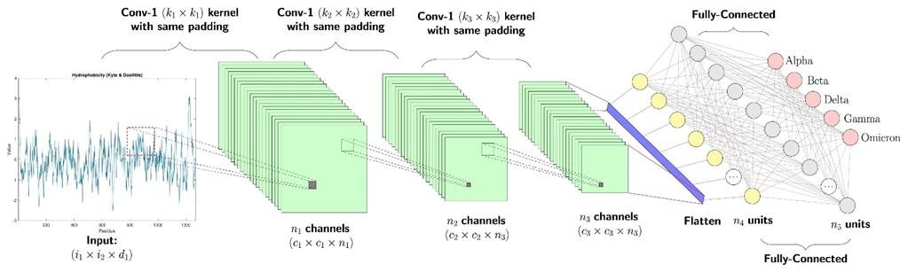
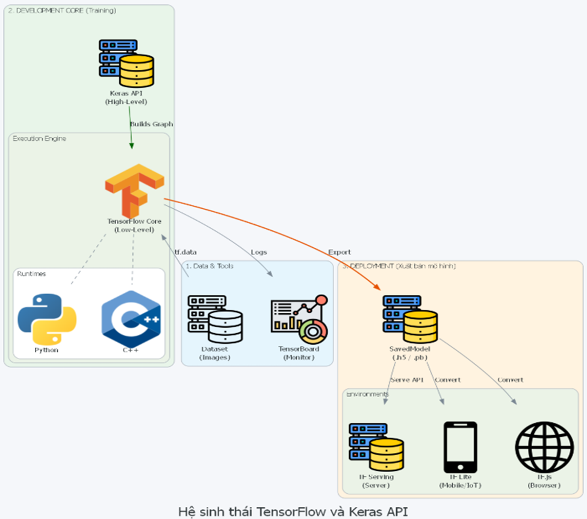
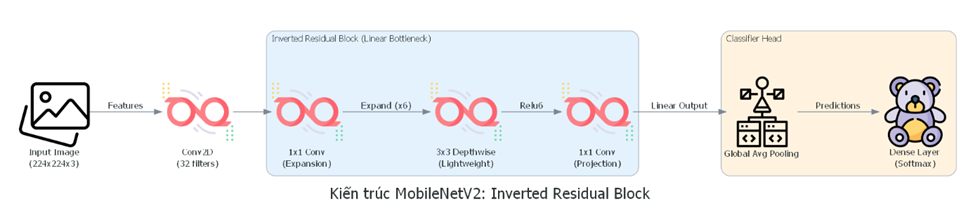
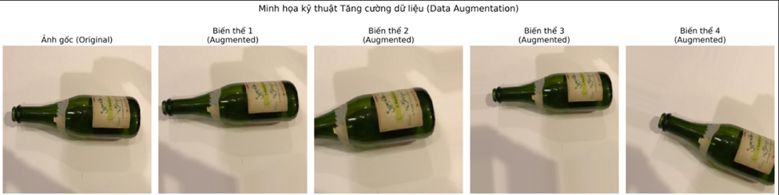
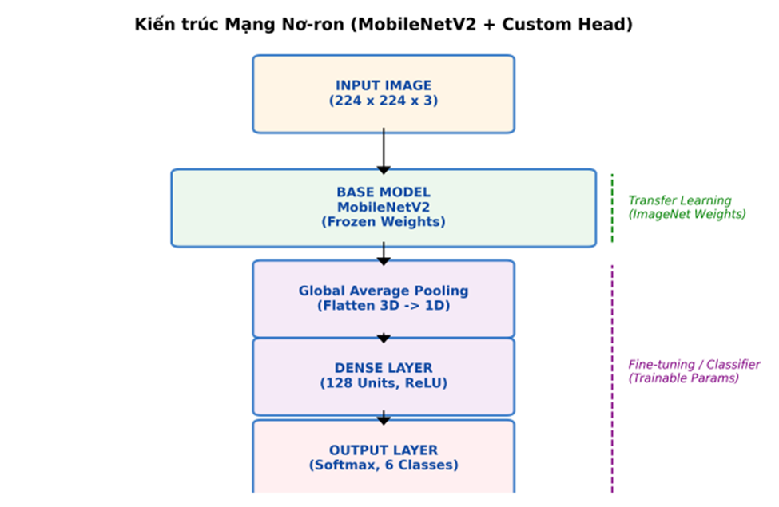
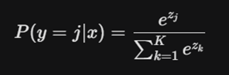
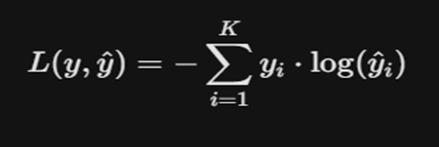
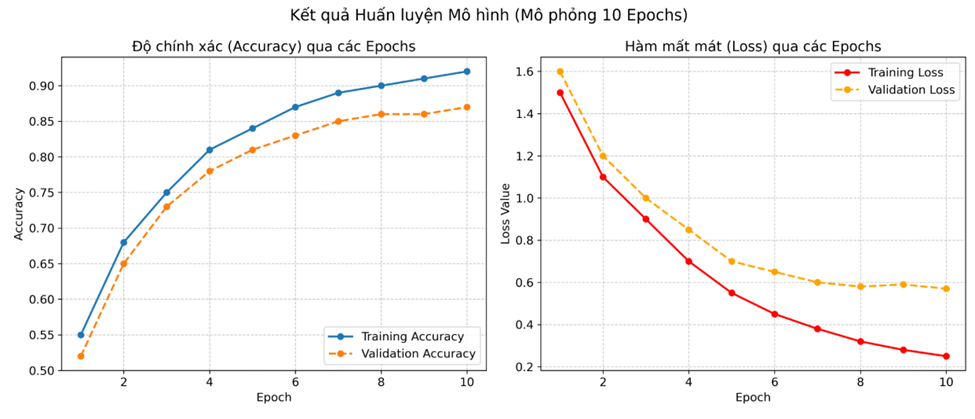
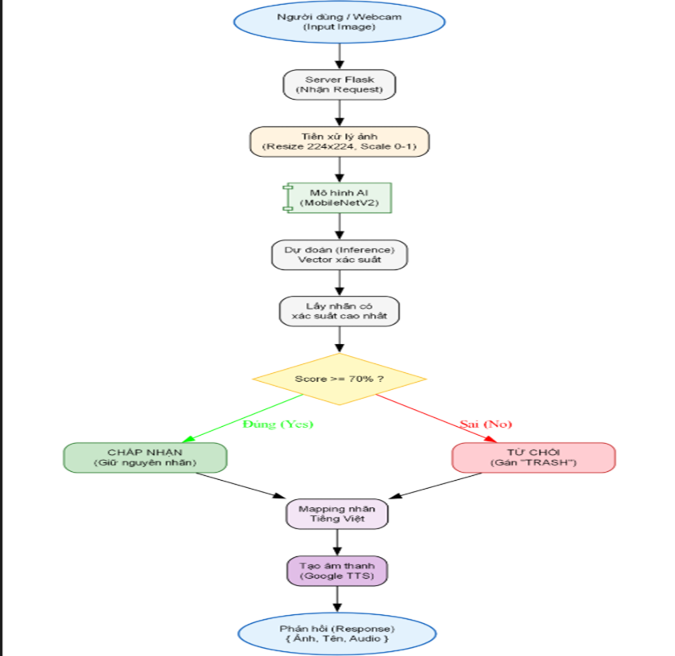
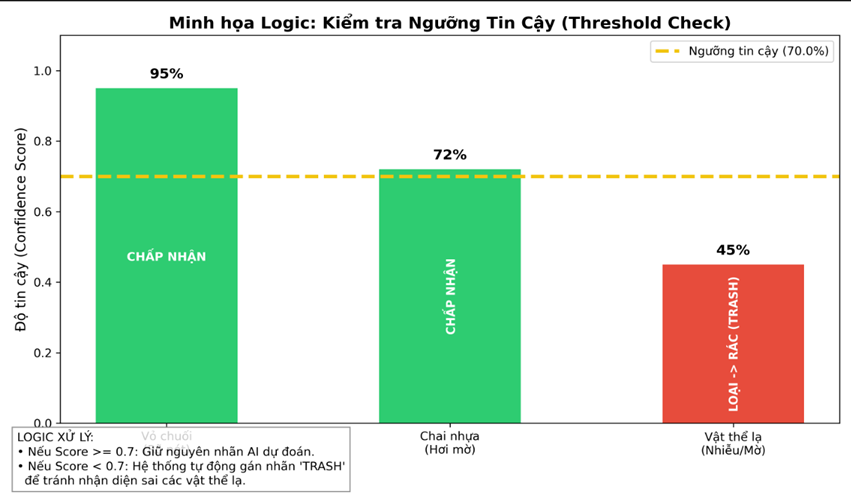

II. CHI TIẾT KỸ THUẬT VÀ CƠ CHẾ HOẠT ĐỘNG CỦA HỆ THỐNG

2.1. Phân tích và Lựa chọn Công nghệ

  Mục này trình bày tổng quan về hệ sinh thái công nghệ được lựa chọn cho dự án, lý do đề xuất và vai trò cụ thể của từng thành phần. Việc lựa chọn stack công nghệ (technology stack) phù hợp là yếu tố tiên quyết ảnh hưởng trực tiếp đến hiệu năng (performance), độ chính xác (accuracy) và trải nghiệm người dùng trong hệ thống phân loại rác thải.
  
2.1.1. AI & Deep Learning (TensorFlow/Keras & MobileNetV2)

  Phân hệ AI đóng vai trò là "bộ não" trung tâm của toàn bộ hệ thống, chịu trách nhiệm xử lý các luồng dữ liệu hình ảnh phức tạp để đưa ra kết quả phân loại rác thải chính xác. Trong dự án này, chúng tôi lựa chọn sự kết hợp giữa TensorFlow và Keras để xây dựng lớp học sâu (Deep Learning).
  
a. Framework và Thư viện: TensorFlow & Keras

  TensorFlow (được phát triển bởi Google) kết hợp với Keras API được chọn làm nền tảng cốt lõi để phát triển mô hình. Đây là tiêu chuẩn công nghiệp hiện nay cho các bài toán Thị giác máy tính (Computer Vision).
-	 Vai trò và chức năng trong hệ thống:

  Xây dựng kiến trúc Mạng nơ-ron tích chập (CNN): TensorFlow cung cấp các khối xây dựng cơ bản (building blocks) như các lớp tích chập (Conv2D), lớp gộp (MaxPooling), và lớp kết nối đầy đủ (Dense). Keras giúp đơn giản hóa việc ghép nối các lớp này thành một kiến trúc mạng hoàn chỉnh theo mô hình tuần tự (Sequential) hoặc mô hình chức năng (Functional API).

      Hình 2.1.1. Kiến trúc tổng quát của mạng nơ-ron tích chập (CNN) được xây dựng trên nền tảng TensorFlow.

  Sơ đồ minh họa dòng dữ liệu qua một mạng CNN cơ bản. Bắt đầu từ "Input Image" (ảnh đầu vào), dữ liệu đi qua lớp "Convolution" (tích chập) để trích xuất đặc trưng, sau đó qua lớp "Pooling" (gộp) để giảm chiều dữ liệu, tiếp theo là lớp "Fully Connected" (kết nối đầy đủ) để phân loại, và cuối cùng đưa ra kết quả tại "Output". Các mũi tên chỉ hướng đi của dữ liệu trong quá trình xử lý.
  
  Thực hiện Huấn luyện (Training): Framework chịu trách nhiệm nạp dữ liệu ảnh đã được gán nhãn, thực hiện quá trình lan truyền xuôi (forward propagation) để dự đoán và tính toán sai số so với nhãn thực tế. 
  
  Tối ưu hóa trọng số (Optimization): Hệ thống sử dụng các thuật toán tối ưu hóa tiên tiến như Adam (Adaptive Moment Estimation) hoặc SGD (Stochastic Gradient Descent). Các thuật toán này tự động điều chỉnh hàng triệu tham số (trọng số) trong mạng nơ-ron để giảm thiểu hàm mất mát (loss function), giúp mô hình ngày càng thông minh hơn qua từng vòng lặp (epoch). 
  
  Đóng gói và Xuất bản mô hình (Model Export): Sau khi đạt độ chính xác yêu cầu, mô hình được trích xuất dưới định dạng chuẩn .h5 (HDF5) hoặc SavedModel. Định dạng này chứa toàn bộ cấu trúc mạng và các trọng số đã huấn luyện, cho phép dễ dàng tích hợp vào backend Flask mà không cần huấn luyện lại.
  
-	Lý do lựa chọn công nghệ:
•	Hiệu năng tính toán cao: TensorFlow hỗ trợ tính toán song song và tận dụng sức mạnh của GPU (Graphics Processing Unit) thông qua CUDA, giúp giảm thời gian huấn luyện từ vài ngày xuống còn vài giờ đối với các tập dữ liệu lớn.

•	Hệ sinh thái và Cộng đồng: Là thư viện Deep Learning phổ biến nhất thế giới, TensorFlow có tài liệu kỹ thuật phong phú. Điều này giúp nhóm phát triển dễ dàng tìm kiếm giải pháp cho các lỗi phát sinh (debugging) và tiếp cận các mô hình tiên tiến (State-of-the-art) được cộng đồng chia sẻ.

•	Khả năng tích hợp Python: do được viết tối ưu chjo Python, TensorFlow tương thích hoàn hảo với các thư viện xử lí dữ liệu khác trong dự án như NumPy, Pandas và đặc biệt Flask, tạo nên một quy trình phát triển liền mạch.

        Hình 2.1.2. Hệ sinh thái TensorFlow và mối quan hệ với Keras API.
  Sơ đồ minh họa cấu trúc hệ sinh thái TensorFlow. Tại lớp lõi (Core) là nền tảng tính toán mạnh mẽ hỗ trợ đa ngôn ngữ (C++, Python). Phía trên là Keras - API cấp cao giúp người dùng xây dựng mô hình dễ dàng. 
Các nhánh mở rộng xung quanh thể hiện khả năng triển khai đa dạng: TensorFlow Lite cho thiết bị di động/IoT, TensorFlow.js cho trình duyệt web và TFX cho việc vận hành hệ thống máy học quy mô lớn (Production).
  
b. Kiến trúc Mô hình: MobileNetV2

  Thay vì tự xây dựng một mạng CNN từ đầu, dự án sử dụng MobileNetV2 – một kiến trúc tiên tiến được Google phát triển, tối ưu hóa đặc biệt cho các thiết bị có tài nguyên tính toán hạn chế (Edge Devices).
  
•	Đặc điểm kỹ thuật nổi bật:
    
  o	Inverted Residual Blocks (Khối dư đảo ngược): Khác với ResNet truyền thống, MobileNetV2 mở rộng số lượng kênh (expand) ở lớp giữa để trích xuất đặc trưng, sau đó nén lại (project) ở đầu ra. Điều này giúp giảm số lượng tham số nhưng vẫn giữ được độ sâu và thông tin quan trọng của mạng.

  o	Depthwise Separable Convolutions: Đây là kỹ thuật chia nhỏ quá trình tích chập tiêu chuẩn thành hai bước: tích chập chiều sâu (Depthwise) và tích chập điểm (Pointwise). Kỹ thuật này giảm khối lượng tính toán đi khoảng 8-9 lần so với tích chập thường.
      
•	Lý do lựa chọn cho dự án phân loại rác thải:
  o	Lightweight & Low Latency: Phù hợp hoàn hảo cho bài toán web/mobile cần tốc độ phản hồi tức thì (real-time inference).
  o	Transfer Learning (Học chuyển giao): Dễ dàng tinh chỉnh (fine-tune) trên tập dữ liệu rác thải mới mà không cần huấn luyện lại từ đầu, tiết kiệm thời gian và tài nguyên máy tính.
  o	Cân bằng hiệu năng: Đảm bảo độ chính xác (Accuracy) cao trong khi vẫn giữ được tốc độ xử lý nhanh (FPS) trên server cấu hình trung bình.

      Hình 2.1.3. Sơ đồ kiến trúc khối Inverted Residual trong MobileNetV2.
  Hình ảnh minh họa luồng xử lý dữ liệu qua một khối MobileNetV2 điển hình. Dữ liệu đầu vào đi qua lớp 1x1 Conv (Expansion) để tăng số chiều, tiếp theo là lớp 3x3 Depthwise Conv để xử lý không gian, và cuối cùng là 1x1 Conv (Projection) để nén dữ liệu lại. Đường kết nối tắt (Residual Connection) giúp bảo toàn thông tin giữa các lớp.
  
2.1.2 Tổng quan Kiến trúc và Công nghệ Hệ thống

a. Khối Backend (Flask - Python)

  Flask đóng vai trò là cầu nối (API Gateway) giữa giao diện người dùng và mô hình trí tuệ nhân tạo.
  
Chức năng chính:
  
  Thiết lập Web Server để lắng nghe các HTTP Request (GET/POST).
  
  Tiếp nhận dữ liệu ảnh từ client (dưới dạng Base64 hoặc Multipart Form).
  
  Điều phối luồng xử lý: Nhận ảnh → Tiền xử lý → Gọi Model dự đoán → Trả về kết quả JSON.
  
Lý do lựa chọn:

  Micro-framework: Cấu trúc cực kỳ gọn nhẹ, không dư thừa các tính năng không cần thiết, giúp khởi động server nhanh.

  Hệ sinh thái Python: Flask được viết bằng Python, do đó việc tích hợp với TensorFlow, NumPy hay Pillow là hoàn toàn tự nhiên (native integration), không cần cầu nối ngôn ngữ phức tạp.
  
  Khả năng mở rộng: Dễ dàng nâng cấp lên các kiến trúc phức tạp hơn (như Docker containerization) sau này.
  
b. Khối Frontend (HTML5, CSS3, JavaScript)

  Giao diện người dùng được thiết kế với tiêu chí: Tối giản – Trực quan – Dễ tiếp cận.
  
	HTML5: Xây dựng khung xương cho trang web, hỗ trợ các thẻ đa phương tiện để hiển thị camera/webcam.
  
	CSS3: Định dạng giao diện hiện đại (Modern UI), đảm bảo tính Responsive (hiển thị tốt trên cả máy tính và điện thoại).
  
	JavaScript (ES6):
  
	Xử lý logic phía client (Client-side logic).
  
	Sử dụng Webcam API để truy cập camera thiết bị theo thời gian thực.
  
	Thực hiện AJAX request để gửi dữ liệu ảnh (Base64) lên server mà không cần tải lại trang (No-reload).
  
	Lý do lựa chọn: Đây là bộ ba công nghệ tiêu chuẩn của web, đảm bảo chạy ổn định trên mọi trình duyệt phổ biến (Chrome, Firefox, Edge) mà người dùng không cần cài đặt thêm plugin.
  
c. Thư viện Xử lý ảnh (Pillow & NumPy)

  Đây là lớp trung gian quan trọng giúp "phiên dịch" dữ liệu ảnh thô thành ngôn ngữ mà máy tính có thể hiểu được.
  
	Pillow (PIL): Chịu trách nhiệm thao tác file ảnh cơ bản như mở file, thay đổi kích thước (Resize về 224x224 pixel cho MobileNetV2), và chuyển đổi hệ màu (RGB).
  
	NumPy:
  
	Chuyển đổi đối tượng ảnh (Image object) thành các mảng đa chiều (Tensor/Matrix).
  
	Thực hiện chuẩn hóa dữ liệu (Normalization) và thay đổi chiều (Reshape/Expand Dims) để phù hợp với đầu vào (Input shape) của mô hình.
  
	Lý do lựa chọn: Tốc độ xử lý ma trận cực nhanh, tối ưu hóa bộ nhớ và là chuẩn chung của cộng đồng Data Science.
  
  Đánh giá tổng quan về kiến trúc này
  
  Sự kết hợp giữa TensorFlow (AI) + Flask (Backend) + JS (Frontend) tạo nên một mô hình End-to-End hoàn chỉnh.
  
	Tính nhất quán: Sử dụng Python làm ngôn ngữ chủ đạo cho cả AI và Backend giúp code dễ bảo trì.
  
	Hiệu năng: MobileNetV2 kết hợp với Flask đảm bảo độ trễ thấp, mang lại trải nghiệm mượt mà.
  
	Tính thực tiễn: Công nghệ được chọn đều là mã nguồn mở, phổ biến, dễ triển khai và chi phí thấp, phù hợp hoàn toàn với yêu cầu của một đồ án thực tế.
  
2.2. Cơ chế hoạt động chi tiết của Data Augmentation

  Quá trình tăng cường dữ liệu (DataAugmentation) sử dụng lớp ImageDataGenerator thực hiện các biến đổi hình học (Geometric Transformations) lên ảnh gốc. Dưới đây là phân tích chi tiết từng kỹ thuật.

      Hình 2.2: Hình ảnh minh họa Data Augmentation
      
a. Rescaling (Chuẩn hóa dữ liệu)

	Tham số: rescale= 1. /255
  
	Mô tả kỹ thuật: Đây là bước tiền xử lý bắt buộc, không phải là biến đổi hình học. Ảnh kỹ thuật số thường được lưu trữ dưới dạng ma trận các số nguyên từ 0 đến 255 (đối với ảnh 8-bit). Tham số này thực hiện phép chia vô hướng từng điểm ảnh (pixel) cho 255.
  
	Mục đích trong mô hình:
  
	Chuyển đổi dữ liệu về không gian [0, 1].
  
	Giúp hàm kích hoạt và thuật toán tối ưu hóa (như Adam) hoạt động hiệu quả hơn, tránh hiện tượng bão hòa gradient (gradient saturation) và giúp mô hình hội tụ nhanh hơn.
  
b. Rotation (Xoay ảnh)

	Tham số: rotation_range=20
  
	Mô tả kỹ thuật: Mô hình sẽ chọn ngẫu nhiên một góc θ trong [-20^0,+20^0] và xoay bức ảnh theo góc đó. Các vùng trống sinh ra sau khi xoay sẽ được lấp đầy theo cơ chế mặc định (thường là 'nearest').
  
	Ý nghĩa thực tế: Rác thải trong thực tế không bao giờ nằm ngay ngắn theo một trục cố định. Một chai nhựa hay vỏ lon có thể nằm nghiêng, nằm chéo tùy theo cách người dùng vứt. Việc xoay ảnh giúp mô hình học được tính bất biến quay (rotational invariance) – tức là nhận diện được rác dù nó nằm ở góc độ nào.
  
c. Width/Height Shift (Dịch chuyển ngang/dọc)

	Tham số: width_shift_range=0.2, height_shift_range=0.2
  
	Mô tả kỹ thuật: Dịch chuyển toàn bộ khung hình sang trái/phải hoặc lên/xuống một khoảng ngẫu nhiên tối đa 20% kích thước ảnh.
  
	Ý nghĩa thực tế: Khi người dùng chụp ảnh hoặc khi camera quét rác, vật thể không phải lúc nào cũng nằm chính giữa khung hình (center). Kỹ thuật này dạy cho mô hình khả năng nhận diện vật thể ở các vị trí biên hoặc góc ảnh (positional invariance), tránh việc mô hình chỉ học được các đặc trưng ở trung tâm.
  
d. Horizontal Flip (Lật ngang)

	Tham số: horizontal_flip=True
  
	Mô tả kỹ thuật: Lật ngược bức ảnh qua trục dọc (tương tự như nhìn qua gương).
  
	Ý nghĩa thực tế: Đối với rác thải, tính chất của vật thể không thay đổi khi bị lật ngược. Ví dụ: Một hộp giấy dù quay nhãn sang trái hay sang phải thì bản chất vẫn là giấy. Kỹ thuật này giúp nhân đôi số lượng biến thể dữ liệu một cách hiệu quả mà không làm mất đi ý nghĩa ngữ nghĩa của ảnh.

e. Zoom (Phóng to/Thu nhỏ)

	Tham số: zoom_range=0.2
  
	Mô tả kỹ thuật: Phóng to hoặc thu nhỏ ngẫu nhiên hình ảnh trong khoảng [0.8,1.2] (tức là thay đổi kích thước từ 80% đến 120% so với gốc).
  
	Ý nghĩa thực tế: Mô phỏng khoảng cách chụp ảnh đa dạng. Người dùng có thể đưa camera lại rất gần rác (ảnh to) hoặc đứng từ xa (ảnh nhỏ). Việc này giúp mô hình học được các đặc trưng ở nhiều tỉ lệ khác nhau (scale invariance).
  
f. Shear (Biến đổi cắt/xén nghiêng)

	Tham số: shear_range=0.2
  
	Mô tả kỹ thuật: Giữ cố định một trục và kéo nghiêng trục còn lại theo một góc nhất định (tạo hình bình hành từ hình chữ nhật).
  
	Ý nghĩa thực tế: Giả lập sự thay đổi về góc nhìn 3D (perspective). Khi camera không nhìn trực diện vuông góc với rác mà nhìn từ một góc nghiêng, hình dạng vật thể sẽ bị biến đổi hình học. Shear giúp mô hình nhận diện tốt hơn trong các trường hợp góc chụp không lý tưởng này.

2.3. Kiến trúc Mô hình Deep Learning (Model Architecture)

a. Chức năng

  Phân hệ này đóng vai trò là lõi xử lý thông minh ("Core Intelligence") của toàn bộ hệ thống. Chức năng chính của nó là tiếp nhận ma trận điểm ảnh (pixel matrix) từ khâu tiền xử lý, thực hiện hàng loạt các phép tính tích chập để trích xuất các đặc trưng thị giác, và cuối cùng ánh xạ các đặc trưng đó thành một vector xác suất tương ứng với 6 nhãn rác thải mục tiêu.

b. Cơ chế hoạt động: Transfer Learning với MobileNetV2

  Hệ thống áp dụng phương pháp Học chuyển giao (Transfer Learning). Thay vì huấn luyện một mạng nơ-ron từ con số không (với trọng số khởi tạo ngẫu nhiên), hệ thống thừa hưởng "tri thức" từ một mô hình đã được huấn luyện trên quy mô lớn. Kiến trúc bao gồm hai phần chính ghép nối với nhau.

    Hình 2.3: Hình ảnh minh họa Sơ đồ Kiến trúc Mô hình.

	Tầng Base (Feature Extractor - Bộ trích xuất đặc trưng)\
  
	Kiến trúc nền tảng: Sử dụng mạng MobileNetV2.
  
	Đặc điểm kỹ thuật: Đây là kiến trúc CNN được Google tối ưu hóa cho các nền tảng di động, sử dụng các khối Depthwise Separable Convolution (Tích chập tách biệt chiều sâu) giúp giảm đáng kể số lượng tham số và khối lượng tính toán so với các mạng truyền thống như VGG16 hay ResNet, nhưng vẫn duy trì độ chính xác cao.
  
	Cấu hình khởi tạo:
  
	weights='imagenet': Mô hình được khởi tạo với bộ trọng số đã huấn luyện trên tập dữ liệu ImageNet (chứa 1.4 triệu ảnh với 1000 lớp vật thể). Điều này giúp mô hình đã có sẵn khả năng nhận diện các đường nét, hình khối và kết cấu vật thể cơ bản.
  
	include_top=False: Loại bỏ lớp phân loại 1000 lớp gốc của ImageNet, chỉ giữ lại phần thân (convolutional base) để làm nền tảng trích xuất đặc trưng.
  
	Cơ chế đóng băng (Freezing):
  
	Tham số base_model.trainable = False được thiết lập để "đóng băng" toàn bộ các lớp của MobileNetV2.
  
	Mục đích: Ngăn chặn việc cập nhật trọng số của các lớp này trong quá trình huấn luyện (Backpropagation). Việc này đảm bảo các đặc trưng thị giác tổng quát đã học được từ ImageNet không bị phá vỡ bởi dữ liệu mới, đồng thời giảm đáng kể thời gian huấn luyện.

	Tầng Custom Head (Classifier - Bộ phân loại tùy chỉnh)
  
  Đây là phần được thiết kế mới hoàn toàn để thay thế lớp đầu ra đã bị loại bỏ, chuyên biệt cho bài toán phân loại 6 loại rác.

	Lớp 1: GlobalAveragePooling2D (GAP)
  
	Nguyên lý: Lớp này tính toán giá trị trung bình của từng bản đồ đặc trưng (feature map) kích thước H × W đầu ra từ MobileNetV2, biến đổi nó thành một giá trị duy nhất.
  
	So sánh với Flatten: Khác với Flatten (duỗi phẳng toàn bộ pixel thành vector 1 chiều khổng lồ), GAP giảm chiều dữ liệu cực mạnh (từ 3D tensor xuống 1D vector).
  
	Ưu điểm: Giúp giảm thiểu số lượng tham số cần huấn luyện ở lớp Dense tiếp theo, từ đó ngăn chặn hiệu quả hiện tượng quá khớp (Overfitting) và giúp mô hình bền vững hơn với các dịch chuyển không gian của vật thể trong ảnh.
  
	Lớp 2: Dense (Fully Connected Layer)
  
	Cấu hình: 128 nơ-ron (units), hàm kích hoạt ReLU (Rectified Linear Unit).
  
	Chức năng: Đây là lớp học sâu trung gian. Nó có nhiệm vụ tổng hợp các đặc trưng thị giác từ lớp GAP và học các mối quan hệ phi tuyến tính phức tạp để phân biệt các đặc điểm riêng của rác (ví dụ: sự khác biệt về kết cấu giữa "Bìa carton" nhám và "Giấy" phẳng).
  
	Lớp 3: Output Layer (Lớp đầu ra)
  
	Cấu hình: Số lượng nơ-ron bằng số lớp cần phân loại (NUM_CLASSES = 6).
  
	Hàm kích hoạt: Softmax.
  
	Cơ chế toán học: Hàm Softmax nhận đầu vào là các giá trị thô (logits) từ lớp trước và chuẩn hóa chúng thành một phân phối xác suất:
  

Trong đó:

	  P (y = j | x): Xác suất dự đoán (Predicted Probability) để ảnh đầu vào x thuộc về nhãn j (ví dụ: "Metal" hoặc "Plastic").
  
	  z (Logits): Vector đầu vào của hàm Softmax. Đây là kết quả thô nhận được từ lớp Dense liền trước đó (các giá trị này có thể là số âm, dương hoặc bằng 0 và nằm trong khoảng (-∞, +∞).
  
	  z_j: Giá trị điểm số thô (raw score) tương ứng với lớp cụ thể j đang xét.
  
	  K: Tổng số lớp phân loại. Trong dự án này, K = 6 (tương ứng với 6 loại rác: Metal, Paper, Glass, Plastic, Cardboard, Trash).
  
	  e: Hằng số Euler (≈ 2.71828...), cơ số của logarit tự nhiên.
  
	  Kết quả: Đầu ra là một vector chứa 6 giá trị số thực trong khoảng [0, 1] có tổng bằng 1. Giá trị cao nhất trong vector này sẽ quyết định nhãn dự đoán cuối cùng cho bức ảnh.
  
2.4. Chiến lược Huấn luyện (Training Strategy)

2.4.1. Chức năng

  Giai đoạn huấn luyện là quá trình mô hình "học" từ dữ liệu. Cụ thể, đây là quá trình điều chỉnh các trọng số (weights) và hệ số bias của các lớp Custom Head (lớp Dense và Softmax mới thêm vào).

  Mục tiêu cốt lõi là tìm ra bộ tham số tối ưu sao cho hàm mất mát (Loss Function) đạt giá trị nhỏ nhất. Quá trình này sử dụng cơ chế Lan truyền ngược (Backpropagation): sai số từ đầu ra được tính toán và truyền ngược lại mạng để cập nhật trọng số. Lưu ý rằng, do áp dụng Transfer Learning, các trọng số của phần MobileNetV2 gốc (Base model) được giữ nguyên, chỉ có các lớp mới được cập nhật.

2.4.2. Cơ chế hoạt động chi tiết

  Hệ thống được cấu hình với ba thành phần chiến lược chính:

a. Hàm mất mát (Loss Function): Categorical Crossentropy

	Lý do lựa chọn: Bài toán yêu cầu phân loại hình ảnh vào một trong K=6 nhóm nhãn rời rạc (Metal, Paper, Glass, Plastic, Cardboard, Trash). Đây là bài toán phân loại đa lớp (Multi-class Classification), do đó categorical_crossentropy là lựa chọn tiêu chuẩn.
  
	Cơ chế toán học:
  
  Hàm này đo lường "khoảng cách" giữa hai phân phối xác suất: phân phối dự đoán (yi) ̂:(từ Softmax) và phân phối thực tế y (đã được mã hóa One-hot).

  Công thức tổng quát cho một mẫu dữ liệu:

  Trong đó:

	y_i :Giá trị thực tế (chỉ bằng 1 tại đúng nhãn của ảnh, bằng 0 tại các nhãn khác).
  
	(yi) ̂: Xác suất mô hình dự đoán cho nhãn i.
  
	Ý nghĩa: Hàm này phạt rất nặng (giá trị Loss tăng vọt) nếu mô hình dự đoán xác suất thấp cho nhãn đúng.
  
b. Thuật toán tối ưu (Optimizer): Adam (Adaptive Moment Estimation)

	Lý do lựa chọn: Adam là thuật toán tối ưu hóa hiện đại, kết hợp ưu điểm của hai thuật toán phổ biến khác là AdaGrad và RMSProp. Nó phù hợp với các dữ liệu có nhiều nhiễu hoặc gradient thưa thớt như hình ảnh.
  
	Cơ chế hoạt động: Thay vì sử dụng một tốc độ học (Learning Rate - ∝) cố định cho mọi tham số như SGD truyền thống, Adam tự động điều chỉnh tốc độ học cho từng tham số riêng biệt dựa trên:
  
	Momentum (Động lượng): Lưu lại trung bình trượt của các gradient trong quá khứ để định hướng di chuyển ổn định, tránh bị kẹt tại các điểm tối ưu cục bộ (local minima).
  
	Adaptive Learning Rate: Tự động giảm tốc độ học ở các chiều có biến động lớn và tăng ở các chiều có biến động nhỏ, giúp quá trình hội tụ nhanh và mượt mà hơn.
  
c. Cấu hình Siêu tham số (Hyperparameters Configuration)

	Epochs (Chu kỳ huấn luyện): 10
  
	Giải thích: Một epoch là một lần mô hình duyệt qua trọn vẹn toàn bộ tập dữ liệu huấn luyện.
  
	Tại sao là 10? Trong Transfer Learning, do phần trích xuất đặc trưng (MobileNetV2) đã rất tốt, mô hình chỉ cần tinh chỉnh các lớp cuối cùng. Việc huấn luyện quá lâu (nhiều epochs) trên tập dữ liệu nhỏ có thể dẫn đến hiện tượng Overfitting (học vẹt), làm giảm độ chính xác trên tập kiểm thử. Con số 10 là mức cân bằng hợp lý để mô hình hội tụ.
  
	Batch Size (Kích thước lô): 32
  
	Giải thích: Thay vì cập nhật trọng số sau mỗi tấm ảnh (quá chậm) hoặc sau toàn bộ tập dữ liệu (quá tốn RAM), hệ thống gom nhóm 32 ảnh vào một lần xử lý.
  
	Tại sao là 32? Đây là con số tiêu chuẩn trong Deep Learning (2^5). Nó giúp tận dụng khả năng tính toán song song của GPU/CPU, đồng thời đảm bảo hướng di chuyển của gradient đủ ổn định để mô hình học chính xác.
  
2.5. Phân hệ Ứng dụng & Logi Nghiệp vụ (Application Logic)

2.5.1. Chức năng tổng quan

  Hệ thống triển khai mô hình trí tuệ nhân tạo lên môi trường Web thông qua framework Flask. Phân hệ này đóng vai trò trung gian, chịu trách nhiệm quản lý giao diện tương tác người dùng, xử lý luồng dữ liệu ảnh đầu vào và cung cấp phản hồi thông minh đa phương thức (Văn bản & Âm thanh).

2.5.2. Cơ chế hoạt động chi tiết

  Hệ thống vận hành theo quy trình khép kín gồm 3 bước chặt chẽ:

Bước 1: Tiếp nhận và Tiền xử lý (Input Processing)

  Hệ thống được thiết kế để linh hoạt xử lý dữ liệu từ hai nguồn:

	Nguồn dữ liệu:
  
	Tải lên (Upload): Người dùng chọn file ảnh từ thiết bị.
  
	Webcam (Real-time): Ảnh được chụp trực tiếp và gửi về server dưới dạng chuỗi mã hóa Base64.
  
	Chuẩn hóa dữ liệu: Ảnh đầu vào được xử lý để đồng bộ với định dạng của quá trình huấn luyện:

	Resize: Điều chỉnh kích thước về chuẩn (224 × 224) pixels.
  
	Rescale: Chuẩn hóa giá trị pixel về khoảng [0, 1].
  
Bước 2: Suy luận với "Logic Nghiêm ngặt" (Strict Inference Logic)

  Để đảm bảo độ tin cậy và tránh hiện tượng "ảo giác" (hallucination) của AI, hệ thống áp dụng cơ chế kiểm soát ngưỡng:

	Vector xác suất: Mô hình MobileNetV2 trả về xác suất cho từng nhãn.
  
	Ngưỡng tin cậy (Confidence Threshold): Thiết lập mức sàn CONFIDENCE_THRESHOLD = 70%.
  
	Quy tắc quyết định:
  
	Trường hợp 1 (Tin cậy cao): Nếu Score_max ≥ 0.7 → Chấp nhận nhãn dự đoán.
  
	Trường hợp 2 (Tin cậy thấp): Nếu Score_max < 0.7 →Hệ thống cưỡng chế gán nhãn là "Trash" (Rác không xác định/Khác).
  
	Ý nghĩa: Cơ chế này ngăn chặn việc hệ thống đưa ra dự đoán sai khi gặp vật thể lạ, ảnh mờ hoặc nhiễu, giúp nâng cao trải nghiệm và niềm tin của người dùng.
  
Bước 3: Phản hồi Đa phương thức (Multimodal Output)

  Kết quả trả về không chỉ là văn bản khô khan mà còn tích hợp âm thanh hỗ trợ tiếp cận (Accessibility):

	Bản địa hóa (Localization): Kết quả gốc (Tiếng Anh) được ánh xạ sang Tiếng Việt thông qua từ điển TRANSLATION_MAP.
  
	Text-to-Speech (TTS):
  
	Tạo câu thông báo tự nhiên: "Loại rác được nhận diện là: [Tên rác] ...".
  
	Sử dụng thư viện gTTS (Google Text-to-Speech) để chuyển văn bản thành file âm thanh .mp3.
  
	Phát tự động trên trình duyệt, hỗ trợ người khiếm thị.
  
  

    Hình 2.5.2: Biểu đồ thể hiện độ chính xác và hàm mất mát qua 10 chu kỳ huấn luyện.

2.5.3. Sơ đồ Luồng dữ liệu (Data Flow Diagram)

  Để đảm bảo hệ thống hoạt động chính xác và xử lý được các trường hợp vật thể không nằm trong tập dữ liệu huấn luyện, chúng tôi thiết kế luồng xử lý dữ liệu (Data Flow) tích hợp cơ chế kiểm tra ngưỡng tin cậy (Confidence Threshold).

  Quy trình xử lý từ lúc người dùng gửi ảnh đến khi nhận kết quả được mô tả chi tiết trong sơ đồ dưới đây:

    Hình 2.5.3: Sơ đồ luồng dữ liệu và logic xử lý ngưỡng tin cậy của hệ thống.
    
  Mô tả luồng xử lý:

	Input: Ảnh đầu vào từ Webcam hoặc file upload của người dùng (định dạng File hoặc Base64).
	Tiền xử lý (Preprocessing): Ảnh được thay đổi kích thước về 224 × 224pixel và chuẩn hóa giá trị pixel về khoảng [0, 1] để phù hợp với đầu vào của mô hình MobileNetV2.
  
	Dự đoán (Inference): Mô hình AI trả về một vector xác suất cho các lớp. Hệ thống chọn nhãn có điểm số cao nhất (Pmax).
  
	Kiểm tra Ngưỡng (Threshold Check):
  
	Hệ thống thiết lập ngưỡng tin cậy θ = 0.7 (70%).
  
	Nếu Pmax ≥ 0.7: Kết quả được chấp nhận.
  
	Nếu Pmax < 0.7: Hệ thống từ chối kết quả dự đoán và gán nhãn là "TRASH" (Rác/Vật thể lạ không xác định).
  
	Hậu xử lý: Kết quả cuối cùng được ánh xạ sang tên Tiếng Việt và chuyển thành giọng nói qua API Google TTS.
  
2.5.4. Minh họa Logic Ngưỡng Tin cậy (Confidence Threshold Logic)

  Vấn đề lớn nhất của các mô hình phân loại ảnh là việc "ép buộc" gán nhãn cho một vật thể lạ với độ tin cậy thấp. Ví dụ: Khi đưa một chiếc điện thoại vào camera, mô hình có thể nhận diện nhầm là "Pin" với độ tin cậy 45%.

  Để giải quyết vấn đề này, logic "Ngưỡng tin cậy 70%" hoạt động như một bộ lọc (filter). Biểu đồ dưới đây minh họa cách hệ thống ra quyết định trong 3 trường hợp 

    Hình 2.5.4: Minh họa quyết định của hệ thống dựa trên điểm số tin cậy.

  Phân tích biểu đồ:

	Trường hợp 1 (Giấy): Độ tin cậy 95% > 70% →Chấp nhận.
  
	Trường hợp 2 (Chai nhựa): Độ tin cậy 72% > 70% →Chấp nhận.
  
	Trường hợp 3 (Vật thể lạ/Nhiễu): Độ tin cậy 45% < 70% → Loại bỏ, gán nhãn "TRASH".
 

